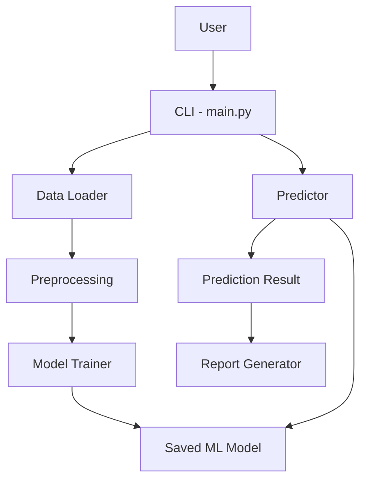

# spamsheild
# SpamShield - AI Spam Message Detection System

## 1. Project Overview
SpamShield is a command-line AI application that classifies text messages as **SPAM** or **NOT SPAM**. It uses Natural Language Processing (NLP) and a machine-learning text classification model.

The project demonstrates a complete workflow: dataset loading, text preprocessing, model training, prediction, evaluation, and report generation.

## 2. Problem Statement
Unwanted promotional and fraudulent messages can make it difficult for users to identify useful messages. SpamShield provides a lightweight automated method for classifying messages using machine learning.

## 3. Objectives
- Classify messages as SPAM or NOT SPAM.
- Apply basic NLP preprocessing.
- Train a machine-learning classification model.
- Display prediction probability.
- Provide dataset and model evaluation.
- Generate a simple prediction report.
- Keep the application executable from a terminal.

## 4. Features
- Train a text classification model from the included dataset.
- Predict individual messages.
- Show prediction confidence.
- View model evaluation metrics.
- Generate a text report.
- Validate empty user input.
- Run automated tests with pytest.

## 5. Technologies
- Python 3.10+
- Pandas
- Scikit-learn
- Joblib
- Pytest

## 6. Project Structure
```text
SpamShield/
├── README.md
├── statement.md
├── requirements.txt
├── .gitignore
├── main.py
├── data/
│   └── spam.csv
├── src/
│   ├── __init__.py
│   ├── data_loader.py
│   ├── preprocessing.py
│   ├── trainer.py
│   ├── predictor.py
│   ├── analyzer.py
│   └── report_generator.py
├── models/
├── outputs/
└── tests/
    ├── __init__.py
    └── test_predictor.py
```

## 7. Dataset
The included dataset is a small educational dataset created for this project. It contains two columns:
- `label`: `spam` or `ham`
- `message`: message text

For a larger academic experiment, the dataset can be replaced with a larger publicly available SMS dataset while keeping the same column format.

## 8. Requirements
Install Python 3.10 or newer.

## 9. Installation

Clone the repository and open the project directory:

```bash
git clone YOUR_REPOSITORY_URL
cd SpamShield
```

Create and activate a virtual environment:

### Windows
```bash
python -m venv venv
venv\Scripts\activate
```

### macOS/Linux
```bash
python3 -m venv venv
source venv/bin/activate
```

Install dependencies:

```bash
pip install -r requirements.txt
```

## 10. Run the Project

```bash
python main.py
```

On the first run, the application trains and saves the model automatically.

## 11. Menu
The application provides:
1. Predict a message
2. Evaluate the model
3. Generate a prediction report
4. Exit

## 12. Example

Input:
```text
Congratulations! You have won a free cash prize. Claim now.
```

Possible output:
```text
Prediction: SPAM
Confidence: ...
```

Input:
```text
Please submit the DBMS assignment before tomorrow.
```

Possible output:
```text
Prediction: NOT SPAM
Confidence: ...
```

The exact confidence depends on the trained model and dataset.

## 13. Testing

Run:

```bash
pytest -q
```

The tests verify input validation, prediction output, and report creation.

## 14. Design
The project follows a modular architecture:



## 15. Future Enhancements
- Use a larger real-world dataset.
- Add a graphical/web interface.
- Support multiple languages.
- Store prediction history.
- Add a confusion-matrix visualization.
- Compare multiple machine-learning algorithms.

## 16. Academic Note
This repository is intended as an educational project implementation. Before submission, review, test, understand, and personalize the code, dataset, screenshots, diagrams, report, and explanations according to your course requirements.
